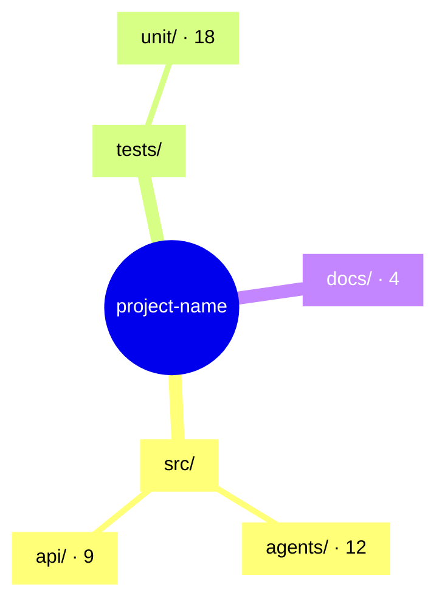

# Context

User instructions (may name a subpath, a depth, or a focus area — may be empty): $ARGUMENTS

The scans below always cover the **current working directory**. If the user named a
subpath, treat these as orientation only and re-scan that subpath yourself with the
Bash tool before drawing anything.

- Tree (depth 4, noise filtered):
!`tree -a -L 4 --dirsfirst -I 'node_modules|.git|.venv|venv|__pycache__|dist|build|out|.next|.turbo|.cache|target|coverage|.mypy_cache|.pytest_cache|.ruff_cache|*.egg-info|.DS_Store'`

- Git-tracked files (authoritative if this is a repo; ignores gitignored noise):
!`git ls-files`

- Directories only, depth 3:
!`find . -maxdepth 3 -type d -not -path '*/node_modules/*' -not -path '*/.git/*' -not -path '*/.venv/*'`

- Top-level disk usage:
!`du -sh ./*`

# Task

Review the folder structure above and present it as a **mindmap**, then critique it.

Handling `$ARGUMENTS`:
- Empty → review the injected scan as-is.
- A path (`src`, `./packages/api`) → run `tree -a -L 4 <path>` yourself and review that.
- A depth (`depth 6`) → re-run `tree` at that depth yourself.
- A focus (`focus on tests`) → keep the full map, weight the review toward that area.

If the injected context is empty or `tree` isn't installed, fall back to `Glob` with
`**/*` plus `find`.

Before drawing anything: read `README.md`, `package.json`, `pyproject.toml`,
`CLAUDE.md`, or equivalent if present, so directory purposes come from evidence
rather than from guessing at names.

## Output format — follow exactly

### 1. Terminal mindmap

Claude Code renders in a terminal, so lead with a plain-text mindmap. Left-to-right
tree, box-drawing characters, one line per node, dotted leader to a short purpose
annotation. Collapse siblings that share a pattern
(`012-migration.sql … 047-migration.sql → 36 files`). Cap at ~40 lines — summarise
below that, don't dump the tree.

```
project-name/
├─ src/ ................... application code · 48 files
│  ├─ agents/ ............. LangGraph nodes · 12 files
│  ├─ api/ ................ FastAPI routes · 9 files
│  └─ lib/ ................ shared utils · 6 files
├─ tests/ ................. pytest suite · 21 files ⚠ no tests for src/api
├─ docs/ .................. 4 files
└─ .claude/ ............... commands, skills, agents
```

Annotate with file count, inferred purpose, and inline flags — `⚠` for a problem,
`?` for a directory whose purpose can't be determined from its contents.

### 2. Mermaid mindmap

Then the same structure as a Mermaid `mindmap` block, for pasting into a README,
GitHub, or Obsidian.

Rules that keep it from failing to parse:
- Indentation defines hierarchy — two spaces per level, no tabs.
- Root is `root((project-name))`.
- **Always** wrap every other node's label in a square-bracket string: `["src/"]`.
  Directory names contain `.`, `-`, `/`, and `_`, all of which break bare nodes.
- Keep to 3–4 levels. Deeper is unreadable — summarise the rest into a count node.



### 3. Review

Keep this tight — findings, not narration. Cover only what actually applies:

- **Convention** — does the layout match the stack's norms (`src/` layout for Python
  packages, colocation vs. `components/` for React, `app/` vs. `pages/` for Next.js)?
  Name the convention it follows or violates.
- **Consistency** — mixed naming (`snake_case` beside `kebab-case` beside
  `camelCase`), singular vs. plural directory names, parallel concepts stored in
  non-parallel places.
- **Depth and breadth** — nesting past 4 levels, single-child chains
  (`src/utils/helpers/string/` holding one file), or a flat directory of 30+ files
  that wants subdivision.
- **Orphans** — files that don't belong where they sit, dead directories nothing
  imports, duplicated concerns split across two trees, `utils/` dumping grounds.
- **Missing** — tests, `README`, `.env.example`, `.gitignore` entries for artifacts
  that are currently tracked, CI config.

### 4. Recommendations

Ranked, at most 5, each concrete: the exact move and a one-line reason, in
`old/path → new/path` form. If a rename would cascade, say which files reference it.

Do not perform any moves. This command is read-only — end by offering to execute the
top recommendations if the user wants them applied.